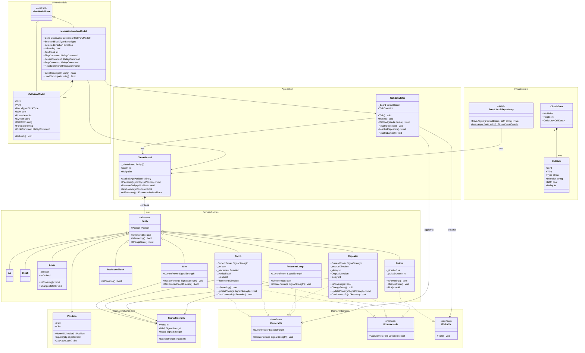

# Redstone Studio — Diagramma delle Classi

```mermaid
classDiagram
    namespace DomainInterfaces {
        class IPowerable {
            <<interface>>
            +CurrentPower SignalStrength
            +UpdatePower(s SignalStrength) void
        }
        class IConnectable {
            <<interface>>
            +CanConnectTo(d Direction) bool
        }
        class ITickable {
            <<interface>>
            +Tick() void
        }
    }

    namespace DomainValueObjects {
        class Position {
            +X int
            +Y int
            +Move(d Direction) Position
            +Equals(obj object) bool
            +GetHashCode() int
        }
        class SignalStrength {
            +Value int
            +Min$ SignalStrength
            +Max$ SignalStrength
            +SignalStrength(value int)
        }
    }

    namespace DomainEntities {
        class Entity {
            <<abstract>>
            +Position Position
            +IsPowered() bool
            +IsPowering() bool
            +ChangeState() void
        }
        class Air
        class Block
        class Lever {
            -_on bool
            +IsOn bool
            +IsPowering() bool
            +ChangeState() void
        }
        class Button {
            -_ticksLeft int
            -_pulseDuration int
            +IsPowering() bool
            +ChangeState() void
            +Tick() void
        }
        class RedstoneBlock {
            +IsPowering() bool
        }
        class Wire {
            +CurrentPower SignalStrength
            +UpdatePower(s SignalStrength) void
            +CanConnectTo(d Direction) bool
        }
        class Torch {
            +CurrentPower SignalStrength
            -_on bool
            -_placement Direction
            -_vertical bool
            +IsOn bool
            +Placement Direction
            +IsPowering() bool
            +UpdatePower(s SignalStrength) void
            +CanConnectTo(d Direction) bool
        }
        class Repeater {
            +CurrentPower SignalStrength
            -_output Direction
            -_delay int
            +Output Direction
            +Delay int
            +IsPowering() bool
            +ChangeState() void
            +UpdatePower(s SignalStrength) void
            +CanConnectTo(d Direction) bool
        }
        class RedstoneLamp {
            +CurrentPower SignalStrength
            +IsPowered() bool
            +UpdatePower(s SignalStrength) void
        }
    }

    namespace Application {
        class CircuitBoard {
            -_circuitBoard Entity[][]
            +Width int
            +Height int
            +GetEntity(p Position) Entity
            +PlaceEntity(e Entity, p Position) void
            +RemoveEntity(p Position) void
            +IsInBounds(p Position) bool
            +AllPositions() IEnumerable~Position~
        }
        class TickSimulator {
            -_board CircuitBoard
            +TickCount int
            +Tick() void
            +Reset() void
            -BfsFlood(seeds Queue) void
            -ResolveTorches() void
            -ResolveRepeaters() void
            -ResolveLamps() void
        }
    }

    namespace Infrastructure {
        class CircuitData {
            +Width int
            +Height int
            +Cells List~CellData~
        }
        class CellData {
            +X int
            +Y int
            +Type string
            +Direction string
            +IsOn bool
            +Delay int
        }
        class JsonCircuitRepository {
            <<static>>
            +SaveAsync(b CircuitBoard, path string)$ Task
            +LoadAsync(path string)$ Task~CircuitBoard~
        }
    }

    namespace UIViewModels {
        class ViewModelBase {
            <<abstract>>
        }
        class CellViewModel {
            +X int
            +Y int
            +BlockType BlockType
            +IsOn bool
            +PowerLevel int
            +Symbol string
            +CellColor string
            +ForeColor string
            +ClickCommand IRelayCommand
            +Refresh() void
        }
        class MainWindowViewModel {
            +Cells ObservableCollection~CellViewModel~
            +SelectedBlockType BlockType
            +SelectedDirection Direction
            +IsRunning bool
            +TickCount int
            +PlayCommand IRelayCommand
            +PauseCommand IRelayCommand
            +StepCommand IRelayCommand
            +ResetCommand IRelayCommand
            +SaveCircuit(path string) Task
            +LoadCircuit(path string) Task
        }
    }

    %% Ereditarietà
    Entity <|-- Air
    Entity <|-- Block
    Entity <|-- Wire
    Entity <|-- Lever
    Entity <|-- Button
    Entity <|-- RedstoneBlock
    Entity <|-- Torch
    Entity <|-- Repeater
    Entity <|-- RedstoneLamp

    %% Implementazione interfacce
    Wire ..|> IPowerable
    Wire ..|> IConnectable
    Torch ..|> IPowerable
    Torch ..|> IConnectable
    Repeater ..|> IPowerable
    Repeater ..|> IConnectable
    RedstoneLamp ..|> IPowerable
    Button ..|> ITickable

    %% Gerarchia UI
    ViewModelBase <|-- CellViewModel
    ViewModelBase <|-- MainWindowViewModel

    %% Application → Domain
    CircuitBoard "1" *-- "many" Entity : contiene
    TickSimulator --> CircuitBoard : usa
    TickSimulator --> IPowerable : aggiorna
    TickSimulator --> ITickable : chiama

    %% Infrastructure → Application
    JsonCircuitRepository --> CircuitBoard : crea
    CircuitData "1" *-- "many" CellData

    %% UI → Application
    MainWindowViewModel --> CircuitBoard
    MainWindowViewModel --> TickSimulator
    MainWindowViewModel "1" *-- "many" CellViewModel

    %% Value Object usage
    Entity --> Position
    Wire --> SignalStrength
    Torch --> SignalStrength
    Repeater --> SignalStrength
    RedstoneLamp --> SignalStrength
```
